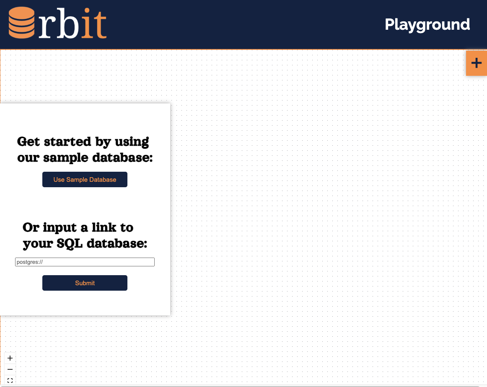
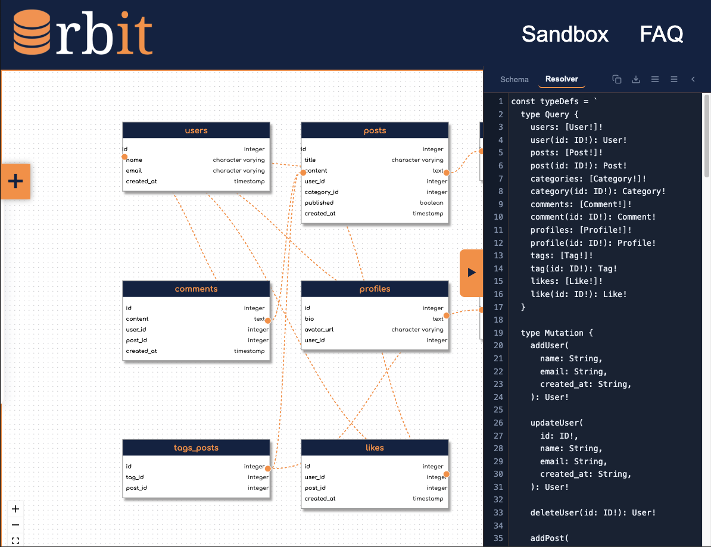
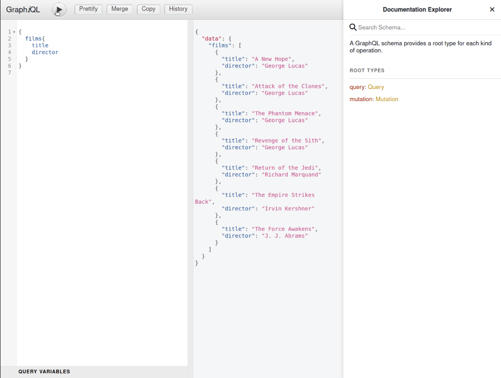

<p align="center">
  
</p>

<p align="center">
  <strong>Orbit</strong> — GraphQL prototyping and relational database visualization
</p>

<p align="center">
  <a href="https://www.orbitdev.io/">
    
  </a>
  <a href="https://img.shields.io/github/package-json/v/oslabs-beta/Orbit">
    
  </a>
  <a href="https://img.shields.io/badge/contributions-welcome-brightgreen.svg?style=flat">
    
  </a>
</p>

---

## Overview

**Orbit** is an open-source developer tool for **GraphQL prototyping** and **relational database visualization**.

Connect to PostgreSQL, explore your schema as an interactive diagram, generate GraphQL types, and test queries in one place.

- Visual database explorer with tables, columns, and foreign-key relationships
- Automatic GraphQL schema generation from database metadata
- Built-in playground for running queries and checking design decisions
- Useful for API design, onboarding, and REST → GraphQL migrations

🔗 [Read the introduction on Medium](https://ryan-mcdaniel.medium.com/introducing-lexiql-56401bbf8d9e)  
🚀 [Accelerated by OS Labs](https://github.com/oslabs-beta/)

---

## Live Demo

**[Try Orbit in the browser](https://www.orbitdev.io/)** (no setup required!)

---

## Table of Contents

- [Features](#features)
- [Quick Start (Local)](#quick-start-local)
- [How It Works](#how-it-works)
- [Example Use Cases](#example-use-cases)
- [Tech Stack](#tech-stack)
- [Contributing](#contributing)
- [Security Note](#security-note)
- [Developers](#developers)
- [License](#license)

---

## Features

- **Visual Database Explorer** — Interactive ER-style view of tables, columns, and relationships.
- **Automatic Schema Generation** — GraphQL type definitions scaffolded from your database.
- **Rapid Prototyping** — Move from connection to runnable queries in minutes.
- **Onboarding & Documentation** — A clear map of the data model for new engineers.
- **REST Migration Aid** — Map relational data to GraphQL types without manual boilerplate.

---

## Quick Start (Local)

**Requirements**

- Node.js 18+ (recommended)
- Optional: access to a PostgreSQL instance (Orbit also provides a sample DB)

**Install and run**

```bash
git clone https://github.com/oslabs-beta/Orbit.git
cd Orbit
npm install
npm run dev
```

```
API runs on http://localhost:3000
Client runs on http://localhost:8080
```

### Notes

Single Page App routing is configured so direct loads and refreshes work on client routes.

If port 3000 is in use, stop the existing process or change the API port via process.env.PORT.

---

## How It Works

1. **Connect to a database**
   - Paste a PostgreSQL connection URI, or
   - Use the built-in **Sample Database** to explore immediately

   

2. **Visualize your data model**
   - Interactive canvas shows tables, columns, data types, and foreign keys
   - Drag to reposition tables for clarity

   

3. **Generate a GraphQL schema**
   - Auto-generates `type` definitions (and scaffolding) from your DB metadata
   - Copy the schema into your project directly from the editor

   

4. **Test queries**
   - Use the built-in playground to compose queries and mutations
   - Inspect available fields and relationships as you iterate

   

---

## Example Use Cases

- **Prototype a new API** — Start from your database and generate the initial schema.
- **Onboard engineers** — Provide a visual map and a safe space to run queries.
- **Migrate from REST** — Translate relational tables to GraphQL types quickly.
- **Explore an unfamiliar DB** — Use the sample database to learn or demo concepts.

---

## Tech Stack

- **Frontend:** React, React Flow
- **Backend:** Node.js, Express, PostgreSQL
- **GraphQL:** GraphQL and related tooling
- **Build:** Webpack
- **Infra:** Vercel Docker (optional)
- **CI/CD:** GitHub Actions (lint, test, build, deploy)

---

## Contributing

Contributions to Orbit are welcome! Open an issue to discuss a change, or submit a pull request with a clear description and focused commits.

- Keep UI changes consistent with Orbit branding and accessibility (keyboard focus, contrast).
- For new features, include brief docs or inline comments.
- Avoid introducing breaking changes without discussion.

---

## Security Note

Keep production credentials secure. If connecting to a live database, review the code and restrict access as appropriate. Avoid using privileged accounts during prototyping.

---

## Developers

- Christopher Carney — [@Carthanial](https://github.com/Carthanial)
- Stacy Learn — [@hello-stacy](https://github.com/hello-stacy)
- John Li — [@john-li7](https://github.com/john-li7)
- Ryan McDaniel — [@ryanmcd118](https://github.com/ryanmcd118) | [ryanmcdaniel.io](https://www.ryanmcdaniel.io/)

---

## License

Licensed under the [MIT License](LICENSE).
